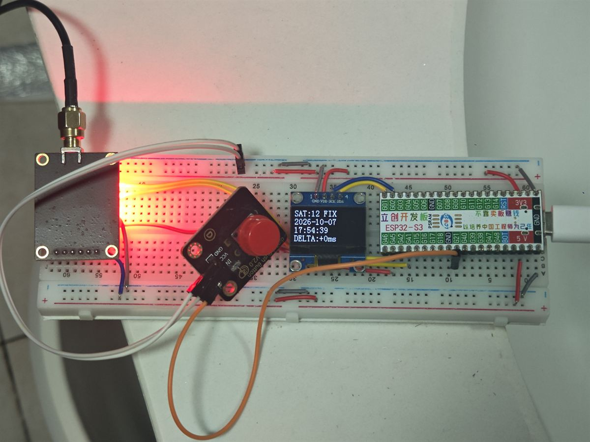

# ESP32-S3 GNSS 授时服务器（Stratum 1 NTP Server）

<p>
  
  
  
</p>

把 **ESP32-S3** 变成一台 **一级（Stratum 1）NTP 时间服务器**：从 GNSS 模块获取 UTC 时间，
用 1PPS（秒脉冲）驯服系统时钟，再通过 WiFi 为局域网提供授时服务，**精度可达亚毫秒级**。

<p align="center">
  
</p>

[English](README.en.md) · **中文**

---

## 为什么做这个项目

- **真正的 Stratum 1** —— 直接锁定 GNSS 卫星时间，不依赖任何上游 NTP 服务器。
- **亚毫秒级精度** —— 由 1PPS 驯服，而非仅靠网络同步；时钟平滑微调，**永不跳变**，
  客户端不会看到时间断层。
- **低成本** —— 只需一块 ESP32-S3、一个 GNSS 模块和一块 OLED，无需专用授时硬件。
- **开箱即用** —— 自动探测 GNSS 波特率，信号丢失时自动重试/重启，并支持手机网页配网
  （更换 WiFi 无需重新烧录）。
- **状态透明** —— OLED 显示定位状态、时间、同步残差、经纬度、IP 与 PPS 状态。

## 功能特性

| 特性 | 说明 |
| --- | --- |
| **GNSS 授时** | 通过 UART 解析 NMEA 获取 UTC 时间与位置，兼容常见模块 |
| **PPS 驯服** | 硬件捕获 1PPS，通过 `adjtime()` 平滑校正 |
| **NTP 服务** | 标准 123 端口，支持 IPv4 / IPv6，NTPv3 / NTPv4 |
| **网页配网** | 长按进入配网热点，手机浏览器配置 WiFi，凭据持久保存 |
| **OLED 显示** | 两个状态页，按键切换 |
| **可选认证** | NTPv4 对称密钥（SHA-256 MAC），默认关闭 |

## 工作原理

```
GNSS 模块 ──NMEA (UART)──▶ 解析 UTC ──首次同步──▶ settimeofday()  一次跳变
     │
     └──1PPS──▶ 硬件捕获 ──▶ 每秒相位误差 ──▶ adjtime()  平滑微调
                                                   │
                              NTP 客户端 ◀── NTP 服务器（应答携带参考时间戳）
```

- **只跳一次**：定位后，系统时钟一次性对齐到 GNSS 时间。
- **持续微调**：每个 PPS 脉冲都会测量与整秒的偏差，并用 `adjtime()` 缓慢加快或放慢时钟来
  消除它 —— **永不跳变**。
- **保护阈值**：小于 2 µs 的偏差忽略；大于 250 ms 的偏差视为不可靠而丢弃，避免振荡与误校正。

---

## 硬件与接线

### 所需硬件

| 部件 | 说明 |
| --- | --- |
| 主控 | ESP32-S3 开发板 |
| GNSS 模块 | 支持 NMEA 输出并带 PPS 引脚（如 u-blox M10 / NEO 系列） |
| 显示屏 | SSD1306 128×64 OLED（I2C 接口） |
| 按键 | 轻触按键 1 个（一端接 GPIO，另一端接 GND） |

### 接线表

引脚定义见 [`main/include/app_config.h`](main/include/app_config.h)，可按需修改。

| ESP32-S3 引脚 | 连接到 | 说明 |
| --- | --- | --- |
| GPIO41 | GNSS RXD | ESP32-S3 发送（TX） |
| GPIO42 | GNSS TXD | ESP32-S3 接收（RX） |
| GPIO45 | GNSS PPS | 秒脉冲输入 |
| GPIO2 | OLED SCL | I2C 时钟 |
| GPIO1 | OLED SDA | I2C 数据 |
| GPIO21 | 按键 | 按下时接地 |
| GND | GNSS / OLED | 共地 |

---

## 快速开始

1. 按上表接好所有连线。
2. 在 [`main/include/app_config.h`](main/include/app_config.h) 中设置 WiFi SSID 与密码。
3. 编译并烧录（见下文）。
4. 上电，等待连接 WiFi 并完成 GNSS 定位（OLED 显示 `SAT:xx FIX`）。
5. 记下 OLED 上显示的 IP，将电脑 / 路由器的 NTP 客户端指向它。

> 首次定位可能需要几分钟（取决于天线放置与天空视野）；室外或靠近窗户效果最好。

## 编译与烧录

需要 [ESP-IDF](https://docs.espressif.com/projects/esp-idf/) **v5.1 或更高版本**
（已适配 v6.1 中 mbedTLS 4.x / PSA Crypto 的变更）。

```bash
idf.py set-target esp32s3
idf.py build
idf.py -p COMx flash monitor   # 替换为实际端口
```

---

## 配置说明

所有配置都在 [`main/include/app_config.h`](main/include/app_config.h)。**必填**：

```c
#define WIFI_SSID     "YOUR_WIFI_SSID"
#define WIFI_PASSWORD "YOUR_WIFI_PASSWORD"
```

其他常用配置项：

| 配置项 | 默认值 | 说明 |
| --- | --- | --- |
| `TIME_ZONE_SPEC` | `"CST-8"` | 时区（POSIX TZ）。仅影响显示 —— NTP 始终提供 UTC |
| `GNSS_TX_PIN` / `GNSS_RX_PIN` | 41 / 42 | GNSS UART 引脚 |
| `GNSS_PPS_PIN` | 45 | PPS 输入引脚 |
| `OLED_SCK_PIN` / `OLED_SDA_PIN` | 2 / 1 | OLED I2C 引脚 |
| `BUTTON_PIN` | 21 | 按键引脚 |
| `BUTTON_LONG_PRESS_MS` | 5000 | 触发配网的长按时长 |
| `PROVISION_AP_PASSWORD` | `"12345678"` | 配网热点密码；留空为开放热点 |
| `PERIODIC_GNSS_REFRESH_MINUTES` | 5 | 每 N 分钟与 GNSS 重新对时 |
| `SYMMETRIC_KEY_AUTHENTICATION_ENABLED` | 0 | 启用 NTPv4 对称密钥认证 |
| `DEBUG_ENABLED` | 0 | 输出详细串口日志 |

> **关于对称密钥**：启用后，请在 [`main/ntp/ntp_auth.c`](main/ntp/ntp_auth.c) →
> `symmetric_keys[]` 中填入**恰好 32 位字母数字字符**的密钥，并设置唯一、非零的
> `key_id`；请替换示例占位符。

---

## 使用说明

### 上电流程

初始化显示与存储 → 连接 WiFi → 等待 GNSS 定位与 PPS 稳定 → 首次对时 →
启动 NTP 服务。

### OLED 页面（短按切换）

**状态页**

| 行 | 说明 |
| --- | --- |
| `SAT:xx FIX / NO FIX` | 卫星数与定位状态（`FIX` 表示已定位） |
| 日期 / 时间 | 本地时间，受时区影响 |
| `DELTA:...` | 上次同步的残差 —— 越小越好 |

**位置页**

| 行 | 说明 |
| --- | --- |
| `LAT` / `LON` | 纬度 / 经度 |
| `IP:...` | 设备 IPv4 地址，用于配置 NTP 客户端 |
| `PPS:ACTIVE / LOST` | 1PPS 状态（`ACTIVE` 表示正在驯服） |

配网期间会改为显示 `CONFIG MODE` 与 `WIFI SAVED` 页面。

### 按键

- **短按** —— 切换 OLED 页面。
- **长按（约 5 秒）** —— 启动 WiFi 配网热点。

### WiFi 配网

1. 长按按键约 5 秒，OLED 显示 `CONFIG MODE`（热点名称、密码、配置地址）。
2. 用手机连接该热点 —— 名称形如 `ESPTIME-1A2B`。
3. 打开 **`http://192.168.4.1/`**。
4. 选择你的 WiFi，输入密码并保存。
5. 热点关闭，设备用新凭据重连（OLED 显示 `WIFI SAVED`）。

> 配网保存的凭据存储在设备上，**优先级高于** `app_config.h` 中的编译期值；
> 下次开机自动复用。

---

## 连接 NTP 客户端

在 OLED 位置页找到 IP（`IP:`）；端口为标准 **123**。

**Windows**（管理员 PowerShell）

```powershell
w32tm /config /manualpeerlist:"<设备IP>,0x9" /syncfromflags:manual /update
w32tm /resync
```

**Linux（chrony）** —— 编辑 `/etc/chrony/chrony.conf`：

```
server <设备IP> iburst
```

**Linux（systemd-timesyncd）** —— 编辑 `/etc/systemd/timesyncd.conf`：

```
[Time]
NTP=<设备IP>
```

> 启用对称密钥认证后，启动日志会打印可直接粘贴到 Meinberg（`ntp.keys`）与
> Chrony（`chrony.keys`）的密钥行。

---

## 常见问题排查

| 现象 | 可能原因 / 处理 |
| --- | --- |
| `SAT:-- no data` | 未收到 GNSS 数据。检查 TX/RX 是否接反、供电、共地与波特率 |
| 长时间 `NO FIX` | 天空视野不佳 —— 移到室外或靠近窗户，等待数分钟；检查天线 |
| `PPS:LOST` | PPS 未接入或电平不对。接 3.3V、走线短、共地 |
| `DELTA` 偏大 | 首次对时或刚恢复时正常；会收敛到毫秒级 |
| 无法连接 WiFi | 长按重新进入配网；密码至少 8 位（或留空） |
| 找不到设备 IP | 尚未连上 WiFi —— 查看串口日志，必要时重新配网 |
| 反复重启 | 多为 GNSS 始终无法就绪。检查接线、供电与模块兼容性；日志会说明原因 |

调试建议：将 `DEBUG_ENABLED` 置为 `1` 可输出更详细的日志（高负载下略增开销）。

---

## 目录结构

```
ESP32S3-NTP-Server-GNSS/
├── main/                      # 应用代码（ESP-IDF 主组件）
│   ├── app_main.c             # 程序入口：初始化并串联各模块
│   ├── CMakeLists.txt         # 组件构建脚本（登记源文件与依赖）
│   ├── idf_component.yml      # 组件依赖声明
│   ├── include/
│   │   └── app_config.h       # 所有可配置项集中于此
│   ├── core/                  # 基础逻辑：时间换算、同步状态、重启
│   ├── gnss/                  # NMEA 解析、UART 收发、PPS 捕获与驯服
│   ├── net/                   # WiFi 连接、网页配网与凭据存储
│   ├── ntp/                   # NTP 服务、报文缓存、对称密钥认证、启动自检
│   └── oled/                  # SSD1306 显示驱动与字库
├── docs/images/               # README 预览图等文档资源
├── CMakeLists.txt             # 项目级构建脚本
├── partitions.csv             # 分区表
├── sdkconfig.defaults         # 默认编译配置
├── LICENSE                    # 本项目许可（Apache-2.0）
├── LICENSES/MIT.txt           # 上游 MIT 许可全文
├── NOTICE                     # 第三方归属说明
├── README.md                  # 中文说明（本文件）
└── README.en.md               # 英文说明
```

---

## 许可证与致谢

- 本项目以 **Apache License 2.0** 发布 —— 见 [LICENSE](LICENSE)。
- 本项目是 [roblatour / ESP32TimeServer](https://github.com/roblatour/ESP32TimeServer) 的 C 语言移植版；
  移植自上游的部分仍遵循其原始 **MIT 许可**（Copyright (c) 2026 Rob Latour）——
  见 [LICENSES/MIT.txt](LICENSES/MIT.txt)。
- 完整的第三方归属说明见 [NOTICE](NOTICE)。

> 这遵循兼容的 MIT → Apache-2.0 模式：项目自身代码为 Apache-2.0，上游 MIT 代码保留其
> 原始声明，二者共存于本仓库。

## 关于作者

- 作者：yourlai
- 网站：[yourlai.com](https://yourlai.com)
- 邮箱：<yourlai@yourlai.icu>